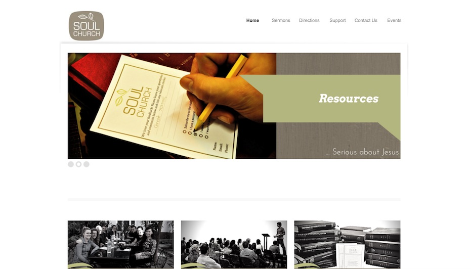

<header hidden><h2>Tools + Philosophy</h2></header>
<section class="description">
  
<em>It's not about the destination, it's the journey</em>

The core product of Vision 100 IT isn't <em>just your website</em> - it's a <em>philosophy of use.</em>

  
There are plenty of products and approaches that will get your church on the Web - our main aim is to help you to do this as best as possible. As a result, we've collated a suite of supported tools that will best help us to help you do IT well.

  
We're eager to ensure that you're equipped to make the most of these tools as the web evolves over time. We won't just build you a website, mailing lists and collaborative storage solutions, but we'll <ul><li>coach you through <em>keeping them up to date</em></li> <li>provide <em>ongoing support</em> as your team members change, and</li> <li><em>walk you through new features</em> and updates as they occur.</li></ul>

  
Although we think this ecosystem is fantastic, selecting our tools over years of experience, your needs may vary. If you already have some solutions sorted, no problem! We'll work with you as best as we can to <em>ensure you're being as effective as possible.</em>

  
<a href="#features">Products 
  <i class="fa fa-angle-down"></i></a>

</section>
<section class="features" id="features">
  

    
  

  

    <header><h3>Websites</h3></header>
    <section>
      <ul>
        <li>Our websites are responsive - supporting phones and tablets</li>
        <li>They are built on Drupal CMS - a modern, powerful and secure platform, easily updated, supports user permissions</li>
        <li>We'll manage your domain name  - you'll never need to worry about renewing or remembering your password every 3 years</li>
        <li>Modular features - features developed for one client become available for all clients</li>
        <li>Running on one of the worlds largest server platforms - uptime and server stability is nothing to worry about</li>
      </ul>
    </section>
  

  

    
  

  

    <header><h3>Administration and relationship management</h3></header>
    <section>
      <ul>
        <li>Implementation and consultation to get you started with Elvanto - an Australian-built Church Management platform</li>
        <li>Flexible mailing lists for all your church-wide and team communications</li>
        <li>Podcasting your sermons</li>
        <li>Newsletter distribution</li>
      </ul>
    </section>
  

  

    
  

  

    <header><h3>Document management</h3></header>
    <section>
      <ul>
        <li>Privately hosted document management platform</li>
        <li>Securely stored, not in the control of Dropbox or Google</li>
        <li>Conflicts easily managed so nothing gets lost</li>
        <li>Folder and file level user permissions</li>
        <li>Integrated into your website</li>
      </ul>
    </section>
  

  

    
  

  

    <header><h3>Consulation + advice</h3></header>
    <section>
      <ul>
        <li>Initial consultation meetings when coming on board</li>
        <li>Recommendations of graphic designers, photographers and video producers</li>
        <li>Access to our documentation: user guides and best practices</li>
        <li>Podcasts and training sessions</li>
        <li>Optional in-depth consultation services</li>
      </ul>
    </section>
  

</section>
